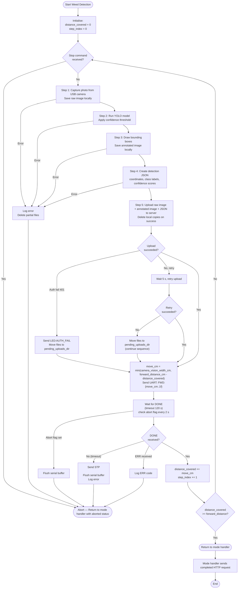

# System Requirements Specification — Agribot Edge Device

**Source:** `abstract requirement.txt`, Device Control UI (`05_device_control.png`)
**Platform:** NVIDIA Jetson Nano | **Language:** Python with threading

---

## 1. System Overview

| Component | Detail |
|-----------|--------|
| Edge Device | NVIDIA Jetson Nano |
| Camera | USB Camera |
| Motor Controller | ESP8266 (NodeMCU) via UART/USB serial |
| AI Model | YOLO `.pt` model for weed detection |
| External System | Web server (REST API) |
| Local Storage | JSON configuration file |

---

## 2. Startup

The startup sequence runs once at boot before the command polling loop begins. Checks execute in order; most failures send an LED error code via serial and exit after writing a log file. Error code 4 (serial port unavailable) is the exception — only a log file is produced.

### Step 0 — Logging

- **SR-01:** On startup, the device SHALL create a `logs/` directory if absent and open a timestamped log file (`logs/{DD-Mon-YYYY_HH-MM-SSam|pm}.log`). All subsequent steps SHALL write to this file.

### Step 1 — Load Settings

- **SR-02:** The device SHALL check for `config.json` in the working directory. If the file does not exist, the device SHALL exit with **error code 1**.
- **SR-03:** If `config.json` exists but cannot be parsed as valid JSON, the device SHALL exit with **error code 2**.
- **SR-04:** The device SHALL validate that all required keys are present in the loaded config:
  `device_id`, `device_secret`, `api_url`, `command_poll_url`, `upload_url`, `completed_url`, `settings_update_status_url`, `device_state_url`, `history_upload_completed_url`, `serial_port`, `serial_baud_rate`, `camera_index`, `camera_vision_width_cm`, `yolo_model_path`, `image_save_dir`, `pending_uploads_dir`, `confidence_threshold`.
  If any key is missing, the device SHALL exit with **error code 3**.
  > `device_id` and `device_secret` are operator-supplied and have no safe defaults. If either is absent or an empty string, the device SHALL exit with **error code 3** and log a message instructing the operator to populate these values in `config.json`.
- **SR-04a:** Camera vision width (cm) defines the ground distance covered by one camera frame. This value SHALL be used as the step distance — the robot moves exactly this distance after each image capture before taking the next picture, ensuring full field coverage with no gaps or overlaps.
- **SR-04b:** The device SHALL validate that `confidence_threshold` is a float in the range `[0.0, 1.0]` and that `camera_vision_width_cm` is a strictly positive integer. If either value fails validation, the device SHALL exit with **error code 3** and log which key holds an invalid value.
- **SR-05:** On error codes 1–3, the device SHALL attempt to open the hard-coded fallback serial port (`/dev/ttyUSB0`) to send `LED:ERR:{code}\n`, then write the error log and exit.
- **SR-05a:** On error codes 5–7, the device SHALL send `LED:ERR:{code}\n` via the already-open serial port, then write the error log and exit.
- **SR-06:** Configuration values SHALL be loaded into in-memory variables for runtime use. The device SHALL create `image_save_dir` and `pending_uploads_dir` if either does not exist. If either directory cannot be created, the device SHALL log the error and exit with **error code 3**.

### Step 2 — Open Serial Port

- **SR-07:** The device SHALL open the serial port specified by `serial_port` and `serial_baud_rate`. If the port fails to open, exit with **error code 4**.
- **SR-08:** The device SHALL flush the serial input buffer, then send `PING\n` and wait up to 3 seconds for an `OK\n` response from the ESP8266. If no valid response is received, exit with **error code 4**. On successful `OK\n` response, send `LED:STARTUP_INPROGRESS\n` to indicate remaining checks are running.

### Step 3 — Verify Server Connection

- **SR-09:** The device SHALL send `GET {api_url}/devicecheck` with `device_id` and `device_secret` as URL query parameters. If the response is not HTTP 200 within 5 seconds, exit with **error code 5**. Note: all runtime requests use POST with a JSON or multipart body, except the route fetch (SR-27a) which also uses GET with query parameters.

### Step 4 — Camera Self-Test

- **SR-10:** The device SHALL open the camera at `camera_index` via OpenCV, capture one frame, verify the frame is non-empty with non-zero dimensions, then release the camera. If any step fails, exit with **error code 6**.

### Step 5 — YOLO Model Self-Test

- **SR-11:** The device SHALL load the YOLO model from `yolo_model_path` and run inference on a blank test image (`numpy.zeros((640, 640, 3))`). If the load or inference raises an exception, exit with **error code 7**.

### Step 6 — Signal Ready

- **SR-12:** On passing all checks, the device SHALL send `LED:STARTUP_OK\n` via serial, then start the command polling background thread and block the main thread until SIGINT or SIGTERM. On receiving SIGINT or SIGTERM, the device SHALL send `STP\n` to the ESP8266 via serial, send `LED:SHUTDOWN\n` to indicate the process is terminating, flush the serial input buffer, close the serial port, and exit.

### Error Code Summary

| Code | Stage | Cause |
|------|-------|-------|
| 1 | Settings | `config.json` does not exist |
| 2 | Settings | `config.json` is not valid JSON |
| 3 | Settings | One or more required config keys are missing, empty, or hold an invalid value; or a required working directory could not be created |
| 4 | Serial | Port failed to open, or ESP8266 did not respond to `PING` |
| 5 | Server | `/api/devicecheck` did not return HTTP 200 within 5 s |
| 6 | Camera | Camera failed to open or returned an empty frame |
| 7 | YOLO | Model failed to load or inference threw an exception |

---

## 3. Command Polling

- **SR-13:** The device SHALL poll the web server every 2 seconds by sending a `POST` request to `command_poll_url` with a JSON body containing `device_id` and `device_secret`. The poll request SHALL time out after 5 seconds. If the server responds with HTTP 401 or a body indicating unknown device or wrong secret, the device SHALL log the authentication error and send `LED:AUTH_FAIL\n` via serial; polling SHALL continue on the next 2-second cycle.
- **SR-13a:** The device SHALL parse the server's poll response as a JSON object. When the response contains a `command` field with value `"start"`, `"stop"`, `"update"`, `"start_pending_upload"`, or `"stop_pending_upload"`, the device SHALL process it accordingly. When the `command` field is `null` or absent, the device SHALL treat the response as a no-op and resume polling. The device SHALL ignore any response that cannot be parsed as JSON or does not contain a `command` field. If the `command` field contains a value other than the recognised set above, the device SHALL log a warning and treat the response as a no-op. If `"start"` or `"update"` is received but the `payload` field is absent or is not a JSON object, the device SHALL log a warning and treat the response as a no-op. A `"stop"`, `"start_pending_upload"`, or `"stop_pending_upload"` command requires no payload.
- **SR-14:** Polling SHALL run in a background thread independently of any active operation.
- **SR-15:** The device SHALL handle the following commands: `start`, `stop`, `update`, `start_pending_upload`, `stop_pending_upload`.
- **SR-15a:** If a poll request fails (network error or timeout), the device SHALL log the error, send `LED:CONNECTIVITY_ERR\n` via serial, and resume polling on the next 2-second cycle. Poll failures SHALL NOT affect any in-progress operation. When a poll request receives any HTTP response after one or more connectivity failures, the device SHALL send `LED:CONNECTIVITY_OK\n` via serial before processing the response (including before sending `LED:AUTH_FAIL\n` on a 401). A 401 response SHALL be treated as a successful network connection for connectivity-tracking purposes.
- **SR-15b:** No upload attempt is made during normal polling; pending files are uploaded only when a `start_pending_upload` command is received (Section 4a).
- **SR-15c:** Command gating rules by device state:
  - **Idle:** all commands are processed normally.
  - **Mode A/B/C handler active:** `start` and `start_pending_upload` SHALL be logged and ignored. `stop`, `update`, and `stop_pending_upload` SHALL be processed (`stop_pending_upload` is logged and ignored as there is no pending-upload mode to exit).
  - **History Data Upload Mode active:** the polling thread remains running but ONLY `stop_pending_upload` SHALL be processed. All other commands (`start`, `stop`, `update`, `start_pending_upload`) SHALL be logged and ignored for the duration of the mode.

---

## 4. Update Settings Command

- **SR-16:** On receiving `update`, the device SHALL validate, persist, and apply settings as specified by the payload per SR-16a and SR-17.
- **SR-16a:** The `update` payload SHALL be a JSON object. Only `confidence_threshold` and `camera_vision_width_cm` are remotely updatable; all other config fields are read-only from the web application's perspective and SHALL be ignored if present in the payload. The device SHALL log a warning for any unrecognised or read-only field included in the payload, and SHALL add each such field to `blocked_fields` with reason `"unrecognised_field"` so it is reported via SR-17's consolidated notification. The device SHALL validate that `confidence_threshold` is a float in the range `[0.0, 1.0]` and that `camera_vision_width_cm` is a strictly positive integer; if a value fails validation the device SHALL log a warning and leave the corresponding setting unchanged. If `camera_vision_width_cm` is updated while a WDS is in progress, the device SHALL log a warning and ignore the update; the active WDS continues with the value in effect at the time it started. The blocked field is reported to the server via SR-17's consolidated notification. `confidence_threshold` updates SHALL take effect at the next YOLO inference; if a WDS is active, the updated threshold applies from the next iteration's SR-35 onward.
- **SR-17:** After SR-16a processing, the device determines two sets: `applied_fields` (passed validation and not blocked) and `blocked_fields` (failed validation or WDS-blocked). The device SHALL send a single consolidated `POST` to `settings_update_status_url` with a JSON body containing `device_id`, `device_secret`, and a `status` field determined as follows:
  - If `applied_fields` is empty: skip the file write, log the event, and send `"status": "failed"` with a `"failed"` array listing each blocked field and its reason (`"wds_active"` or `"validation_error"`).
  - If `applied_fields` is non-empty and `blocked_fields` is non-empty: write `applied_fields` to the JSON configuration file first; on success apply them to in-memory variables and send `"status": "partial"` with an `"applied"` array and a `"failed"` array; on file-write failure leave in-memory unchanged and send `"status": "failed"` with `"reason": "disk_write_error"`.
  - If `applied_fields` is non-empty and `blocked_fields` is empty: write to the JSON configuration file first; on success apply to in-memory variables and send `"status": "success"`; on file-write failure leave in-memory unchanged and send `"status": "failed"` with `"reason": "disk_write_error"`.

  Each entry in the `"applied"` array SHALL be a string field name (e.g. `"confidence_threshold"`). Each entry in the `"failed"` array SHALL be an object with a `"field"` string (the field name) and a `"reason"` string (`"wds_active"`, `"validation_error"`, or `"unrecognised_field"`). The top-level `"reason": "disk_write_error"` is used when a file-write failure causes the entire update to fail, and no per-field `"failed"` array is included in that case.

  All notification POSTs to `settings_update_status_url` SHALL time out after 5 seconds; if the request fails or times out, the device SHALL log the error and resume polling. If `settings_update_status_url` responds with HTTP 401, the device SHALL log the authentication error, send `LED:AUTH_FAIL\n` via serial, and resume polling.

---

## 4a. History Data Upload Command

- **SR-49:** On receiving `start_pending_upload` while idle, the device SHALL:
  1. POST to `device_state_url` with `{"device_id": "<device_id>", "device_secret": "<device_secret>", "state": "pending_upload"}` (10-second timeout; not retried; failure is logged and the mode proceeds regardless).
  2. Spawn a History Data Upload handler thread (same pattern as Mode A/B/C handlers). The polling thread continues running during the upload to receive commands.
  Only `stop_pending_upload` is acted on while this mode is active (per SR-15c).
- **SR-50:** The handler SHALL process bundles in lexicographic stem order (oldest first). Each bundle is identified by a shared filename stem (`{stem}_raw.jpg`, `{stem}_annotated.jpg`, `{stem}.json`); the `job_id` and `step_index` for each upload SHALL be read from `{stem}.json`. If `{stem}.json` cannot be read or parsed, the device SHALL log an error, skip that bundle, and count it toward `failed`. The device SHALL upload each bundle as a multipart `POST` to `upload_url` with the same format as SR-38 (including `device_id`, `device_secret`, `job_id`, and `step_index` as form fields); each upload attempt SHALL time out after 30 seconds. On successful upload the device SHALL delete the three bundle files. If an upload returns HTTP 401, the device SHALL log the authentication error, send `LED:AUTH_FAIL\n` via serial, and leave the bundle in place. For all other upload failures, the device SHALL retry once after 5 seconds; if the retry also fails, the device SHALL leave the bundle in place and continue to the next bundle. The device SHALL track the count of successfully uploaded bundles (`succeeded`) and bundles left in place (`failed`). After each upload attempt completes (or times out), the handler SHALL check whether `stop_pending_upload` has been received; if so, it SHALL stop processing further bundles and proceed to SR-51.
- **SR-51:** On normal completion (all bundles processed) or early exit via `stop_pending_upload`, the device SHALL:
  1. POST to `history_upload_completed_url` with `{"device_id": "<device_id>", "device_secret": "<device_secret>", "succeeded": <count>, "failed": <count>}` (10-second timeout; not retried). If the request fails, times out, or receives a non-200/non-401 response, the device SHALL log the error. If the server responds with HTTP 401, the device SHALL log the error and send `LED:AUTH_FAIL\n` via serial.
  2. POST to `device_state_url` with `{"device_id": "<device_id>", "device_secret": "<device_secret>", "state": "idle"}` (10-second timeout; not retried; failure is logged).
  3. Return to idle/polling state.
- **SR-52:** If `start_pending_upload` is received while idle but `pending_uploads_dir` contains no bundles, the device SHALL still POST the entry state (`state: "pending_upload"`) to `device_state_url`, immediately send the completion POST with `"succeeded": 0` and `"failed": 0`, then POST `state: "idle"` and return to idle.

---

## 5. Stop Command

- **SR-18:** On receiving `stop`, the device SHALL immediately abort any in-progress operation. In Mode A, `stop` SHALL abort the active movement command. In Modes B and C, `stop` SHALL abort both the active vehicle movement and the weed detection sequence. If the abort occurs mid-iteration with partial files in `image_save_dir`, the device SHALL delete those files.
- **SR-18a:** The polling thread SHALL signal the active mode handler via a shared abort flag (e.g. `threading.Event`). The WDS loop SHALL check this flag at the top of each iteration (before SR-34) and between SR-38 and SR-39; if set, the loop SHALL abort with reason `stopped` and return to the mode handler. When abort is detected between SR-38 and SR-39, no additional file handling is required — SR-38 will have already deleted or moved all iteration files before returning. The WDS SHALL also check the abort flag during the SR-38 retry wait; the 5-second wait SHALL be implemented as a loop with checks every 2 seconds so that a `stop` command interrupts the wait within 2 seconds. If the abort is detected during the SR-38 retry wait, the device SHALL move all three iteration files to `pending_uploads_dir` (preserving detection data) before aborting.
- **SR-19:** The device SHALL return to idle/polling state after stopping. If no operation is in progress when `stop` is received, the device SHALL log the event and remain in idle/polling state. A `stop` command received during History Data Upload Mode SHALL be logged and ignored; use `stop_pending_upload` to exit that mode early.

---

## 6. Start Command — 3 Operation Modes

- **SR-20:** The `start` command payload SHALL include a `mode` field indicating the operation mode: `"A"` for Manual Control, `"B"` for One-Way Weed Detection, `"C"` for Route-Based Weed Detection. The device SHALL dispatch to the corresponding handler based on this field. An unrecognised `mode` value SHALL be logged and ignored.

### Mode A: Manual Control

> **Status: Planned — not yet implemented.**

- **SR-21:** Mode A commands SHALL be delivered as individual `start` payloads each containing `mode: "A"`, a `command` field (`"forward"`, `"backward"`, `"turn_left"`, `"turn_right"`), a `distance_cm` parameter, and for turn commands a `angle_deg` parameter.
- **SR-22:** The device SHALL transmit the corresponding UART frame to the ESP8266 and wait for a `DONE\n` response (timeout: 120 s), checking the abort flag every 2 seconds during the wait. If the abort flag is set, the device SHALL send `STP\n`, flush the serial input buffer to discard the ESP's subsequent `DONE\n`, and return to idle/polling state. On timeout, the device SHALL send `STP\n` and return to idle/polling state. If an `ERR:{code}\n` frame is received before `DONE\n`, the device SHALL log the error code and return to idle/polling state. After receiving `DONE\n` without abort, the device SHALL return to idle/polling state.
- **SR-23:** No camera capture or YOLO inference SHALL occur during manual control.

### Mode B: One-Way Weed Detection

- **SR-24:** The `start` command for this mode SHALL include parameters: `job_id` (unique identifier for this detection job assigned by the web server) and `travel_distance_cm` (total forward distance in centimetres).
- **SR-25:** The device SHALL pass `travel_distance_cm` to the Weed Detection Sequence (Section 7) as `forward_distance_cm` in a single call; the WDS handles iteration internally until the full distance is covered.
- **SR-26:** On completion, the device SHALL send a `POST` request to `completed_url` with JSON body: `{"job_id": "<job_id>", "device_id": "<device_id>", "device_secret": "<device_secret>", "status": "completed", "total_distance_cm": <distance_covered>}`. If the Weed Detection Sequence aborted, the device SHALL instead send `{"job_id": "<job_id>", "device_id": "<device_id>", "device_secret": "<device_secret>", "status": "aborted", "reason": "<timeout|err|stopped>", "total_distance_cm": <distance_covered>}`. The completion POST request SHALL time out after 10 seconds. If the request fails, times out, or receives a non-200/non-401 response, the device SHALL log the error and return to idle/polling state. If the server responds with HTTP 401 or a body indicating unknown device or wrong secret, the device SHALL log the authentication error, send `LED:AUTH_FAIL\n` via serial, and return to idle/polling state. The completion notification is not retried; the server must reconcile job status through other means.

### Mode C: Route-Based Weed Detection

> **Status: Planned — not yet implemented.**

- **SR-27:** The `start` command for this mode SHALL include parameters: `job_id` (unique identifier for this detection job assigned by the web server) and a `route_name` referencing a pre-saved route on the server.
- **SR-27a:** After receiving the `start` command, the device SHALL send a `GET` request to `{api_url}/route` with `route_name`, `device_id`, and `device_secret` as URL query parameters and expect a JSON response with a `"steps"` key containing the ordered list of route steps. The request SHALL time out after 5 seconds. If the request returns HTTP 401 or a body indicating unknown device or wrong secret, the device SHALL log the authentication error, send `LED:AUTH_FAIL\n` via serial, and send the `aborted` completion POST (SR-31) with reason `err`. For all other failures (network error, timeout, or non-200/non-401 response), the device SHALL log the error and send the `aborted` completion POST (SR-31) with reason `err`. If the HTTP 200 response body cannot be parsed as JSON or does not contain a valid ordered list of route steps, the device SHALL log the error and send the `aborted` completion POST (SR-31) with reason `err`. In all failure cases the aborted completion POST SHALL use `total_distance_cm: 0`, since no route steps have been executed.
- **SR-28:** A route SHALL be an ordered list of steps, each with a `type` field (`"forward"`, `"turn_left"`, or `"turn_right"`), and a `value` field (distance in cm for forward steps; angle in degrees for turn steps).
- **SR-28a:** Before iterating route steps, the device SHALL initialise `total_distance_covered = 0`.
- **SR-28b:** For each step in the route in order: if `type` is `"forward"`, apply SR-29; if `type` is `"turn_left"` or `"turn_right"`, apply SR-30. If a step's `type` is unrecognised, the device SHALL log a warning and skip that step.
- **SR-29:** For each forward segment in the route, the device SHALL pass the segment's distance value as `forward_distance_cm` to the Weed Detection Sequence (Section 7), accumulate the returned `distance_covered` into a mode-level `total_distance_covered` variable, then advance to the next route step. If the WDS returns status `aborted`, the device SHALL accumulate the partial `distance_covered` into `total_distance_covered`, cease processing further route steps, and proceed to the aborted branch of SR-31 with the WDS's abort reason.
- **SR-30:** Turn commands SHALL be sent directly to ESP8266 via UART without weed detection: `TLT:{value:.1f}\n` for `turn_left` steps and `TRT:{value:.1f}\n` for `turn_right` steps. The device SHALL wait for `DONE\n` (timeout: 120 s), checking the abort flag every 2 seconds during the wait. On timeout, the device SHALL send `STP\n`, flush the serial input buffer to discard the ESP's subsequent `DONE\n`, log the error, and abort the route with status `aborted` and reason `timeout`. If `ERR:{code}\n` is received, the device SHALL log the error and abort the route with status `aborted` and reason `err`. If the abort flag is set during the wait, the device SHALL exit immediately (flushing the serial buffer per SR-39 / SR-44 pattern) and abort the route with status `aborted` and reason `stopped`. In all abort cases the device SHALL proceed to send the `aborted` completion POST (SR-31).
- **SR-31:** On completing all route steps, the device SHALL send a `POST` request to `completed_url` with JSON body: `{"job_id": "<job_id>", "device_id": "<device_id>", "device_secret": "<device_secret>", "status": "completed", "total_distance_cm": <total_distance_covered>}`. If any route step (WDS call or turn command) aborted, the device SHALL stop processing further route steps and instead send `{"job_id": "<job_id>", "device_id": "<device_id>", "device_secret": "<device_secret>", "status": "aborted", "reason": "<timeout|err|stopped>", "total_distance_cm": <total_distance_covered>}`. The completion POST request SHALL time out after 10 seconds. If the request fails, times out, or receives a non-200/non-401 response, the device SHALL log the error and return to idle/polling state. If the server responds with HTTP 401 or a body indicating unknown device or wrong secret, the device SHALL log the authentication error, send `LED:AUTH_FAIL\n` via serial, and return to idle/polling state. The completion notification is not retried; the server must reconcile job status through other means.

---

## 7. Weed Detection Sequence

> Used in Mode B and Mode C forward segments only.

- **SR-32:** Before starting, the device SHALL initialise `distance_covered = 0` and `step_index = 0`. The loop SHALL continue until `distance_covered >= forward_distance_cm`. Each iteration captures, detects, uploads, and moves the robot forward by `move_cm = min(camera_vision_width_cm, forward_distance_cm - distance_covered)`.
- **SR-33:** The device SHALL repeat Steps 1–5 (SR-34 through SR-38) and SR-39 below for each iteration until `distance_covered >= forward_distance_cm`. On normal completion, the sequence SHALL return `distance_covered` and a status of `completed` to the calling mode handler. On abort (DONE timeout, `ERR:{code}\n` from ESP, camera capture failure, YOLO inference exception, disk I/O failure, or `stop` command), the sequence SHALL return the partial `distance_covered` so far together with a status of `aborted` and a reason of `timeout`, `err`, or `stopped` respectively.

All files for one iteration SHALL share a common stem: `{YYYY-MM-DD_HH-MM-SS}_{step_index}` (e.g. `2026-04-22_09-15-30_3`), giving filenames: `{stem}_raw.jpg`, `{stem}_annotated.jpg`, `{stem}.json`. This stem is used to group files into upload bundles.

| Step | Requirement |
|------|-------------|
| 1 | **SR-34:** Capture a photo from the USB camera and save it to `image_save_dir` as `{stem}_raw.jpg`. If capture fails, the device SHALL log the error, delete any partial files for this iteration, abort the WDS with status `aborted` and reason `err`, and return to the mode handler. |
| 2 | **SR-35:** Run the YOLO `.pt` model on the captured image, applying the configured confidence threshold. If inference raises an exception, the device SHALL log the error, delete any partial files for this iteration, abort the WDS with status `aborted` and reason `err`, and return to the mode handler. |
| 3 | **SR-36:** Draw bounding boxes on all detected weeds and save the annotated image to `image_save_dir` as `{stem}_annotated.jpg`. If saving fails, the device SHALL log the error, delete any partial files for this iteration, abort the WDS with status `aborted` and reason `err`, and return to the mode handler. |
| 4 | **SR-37:** Create a JSON file at `image_save_dir/{stem}.json` containing: `job_id`, `step_index`, detected object coordinates, class labels, and confidence scores. If writing fails, the device SHALL log the error, delete any partial files for this iteration, abort the WDS with status `aborted` and reason `err`, and return to the mode handler. |
| 5 | **SR-38:** Upload `{stem}_raw.jpg`, `{stem}_annotated.jpg`, and `{stem}.json` as a multipart `POST` to `upload_url` including `job_id`, `device_id`, `device_secret`, and `step_index` as form fields; each upload attempt SHALL time out after 30 seconds. Delete all three local files upon successful upload. If the server responds with HTTP 401 or a body indicating unknown device or wrong secret, the device SHALL log the authentication error, send `LED:AUTH_FAIL\n` via serial, and immediately move all three files to `pending_uploads_dir` without retrying (credentials will not change between retries). For all other upload failures, the device SHALL retry once after 5 seconds; if the retry fails, the device SHALL move all three files to `pending_uploads_dir`. In all failure cases the sequence SHALL continue after moving the files. |

- **SR-39:** After Step 5 of each iteration, the device SHALL calculate the actual move distance as `move_cm = min(camera_vision_width_cm, forward_distance_cm - distance_covered)` to avoid overshooting on the final iteration. The device SHALL send `FWD:{move_cm:.1f}\n` to the ESP8266 and wait for `DONE\n` (timeout: 120 seconds), checking the abort flag every 2 seconds during the wait. If the abort flag is set while waiting, the device SHALL exit the wait immediately (the ESP will send `DONE\n` after receiving `STP\n` per SR-44), flush the serial input buffer to discard any pending `DONE\n` from the ESP, then abort the sequence and return to the mode handler with status `aborted` and reason `stopped`. If `ERR:{code}\n` is received during the wait, the device SHALL log the error code and abort the sequence, returning to the mode handler with status `aborted` and reason `err` (per SR-42). If `DONE\n` is not received within the timeout, the device SHALL send `STP\n`, flush the serial input buffer to discard the ESP's subsequent `DONE\n`, log the error, abort the sequence and return to the mode handler with status `aborted` and reason `timeout`. On receiving `DONE\n` without abort, the device SHALL update `distance_covered += move_cm` and `step_index += 1`.

### Flowchart

---

## 8. ESP8266 UART Communication

- **SR-40:** The device SHALL communicate with the ESP8266 over USB serial (UART).
- **SR-41:** All frames transmitted over UART SHALL use the following format. Distance values are in centimetres; angle values are in degrees.

| Frame | Direction | Purpose | Example |
|-------|-----------|---------|---------|
| `PING\n` | Jetson → ESP | Startup handshake — check ESP is alive | `PING\n` |
| `OK\n` | ESP → Jetson | Response to PING | `OK\n` |
| `LED:{status}\n` | Jetson → ESP | Set LED indicator state (see valid values below) | `LED:STARTUP_OK\n` |
| `FWD:{dist:.1f}\n` | Jetson → ESP | Move forward by dist cm | `FWD:45.0\n` |
| `BWD:{dist:.1f}\n` | Jetson → ESP | Move backward by dist cm | `BWD:45.0\n` |
| `TLT:{angle:.1f}\n` | Jetson → ESP | Turn left by angle degrees | `TLT:90.0\n` |
| `TRT:{angle:.1f}\n` | Jetson → ESP | Turn right by angle degrees | `TRT:90.0\n` |
| `STP\n` | Jetson → ESP | Abort current movement immediately; ESP responds with `DONE\n` | `STP\n` |
| `ACK\n` | ESP → Jetson | Command received and started | `ACK\n` |
| `DONE\n` | ESP → Jetson | Movement complete | `DONE\n` |
| `ERR:{code}\n` | ESP → Jetson | Movement failed | `ERR:1\n` |

**Valid `LED:{status}` values:**

| Value | Meaning |
|-------|---------|
| `LED:STARTUP_INPROGRESS\n` | Startup checks are running |
| `LED:STARTUP_OK\n` | All startup checks passed |
| `LED:ERR:1\n` – `LED:ERR:7\n` | Startup failed at the corresponding error code stage |
| `LED:CONNECTIVITY_ERR\n` | Server poll request failed (network error or timeout) |
| `LED:CONNECTIVITY_OK\n` | Server connectivity restored after one or more poll failures |
| `LED:AUTH_FAIL\n` | Server rejected request — unknown device or wrong secret |
| `LED:SHUTDOWN\n` | Device process is terminating (SIGINT/SIGTERM received) |

- **SR-42:** The Jetson Nano SHALL wait for `DONE\n` after sending each movement command, with a maximum timeout of 120 seconds; during a WDS the wait SHALL be implemented as specified in SR-39 (abort-flag-checked loop with serial flush on both abort and timeout). If the timeout expires, the device SHALL send `STP\n` and treat the operation as failed. If an `ACK\n` frame is received before `DONE\n`, the device SHALL discard it and continue waiting for `DONE\n`. If an `ERR:{code}\n` frame is received during an active WDS, the device SHALL log the error code, abort the current sequence and return to the mode handler with status `aborted` and reason `err`; outside an active WDS (e.g. Mode A), the device SHALL log the error code and return to idle.
- **SR-43:** When the Jetson Nano receives a `stop` command from the web server during an active movement, it SHALL immediately transmit `STP\n` to the ESP8266 via UART.
- **SR-44:** The ESP8266 SHALL listen for `STP\n` on UART during movement (non-blocking); on receiving it, the ESP8266 SHALL immediately set the GPIO pin LOW, stop the motor, and send `DONE\n` to the Jetson so the blocking DONE-wait exits immediately.
- **SR-45:** The ESP8266 firmware SHALL use a non-blocking timer (`Ticker` library) for movement duration and interrupt-based UART reading (`Serial` RX interrupt) so the MCU remains responsive to abort commands during active movement. Blocking `delay()` SHALL NOT be used.

---

## 9. Non-Functional Requirements

- **SR-46:** The polling loop and active operation (weed detection / movement) SHALL run concurrently using Python threading.
- **SR-47:** Once the polling thread receives a `stop` command, the active sequence SHALL set the abort flag and cease all abort-flag-checked wait loops within 2 seconds. In Mode A this means the movement DONE-wait exits within 2 seconds. In Modes B and C, all abort-flag-checked loops (iteration checks, DONE-waits, retry-waits) exit within 2 seconds; however, in-flight HTTP upload requests in SR-38 (up to 30 seconds each) are not interruptible and will complete or time out before the abort is processed. History Data Upload Mode (Section 4a) is interruptible via `stop_pending_upload` only; the in-flight HTTP upload request (up to 30 seconds) completes or times out before the interrupt is acted on. A regular `stop` command has no effect during History Data Upload Mode. Due to the 2-second poll interval and 5-second poll timeout, the stop command may take up to 7 seconds to be received after the user issues it on the server, and up to a further 2 seconds to propagate through the active wait loop, giving a total worst-case stop-to-abort latency of 9 seconds.
- **SR-48:** After each upload attempt, local image and JSON files SHALL be either deleted (on successful upload) or moved to `pending_uploads_dir` (on permanent failure) — files SHALL NOT be left in `image_save_dir` after Step 5 completes.
