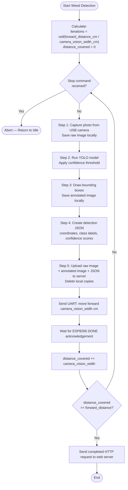

# System Requirements Specification — Agribot Edge Device

**Source:** `abstract requirement.txt`, Device Control UI (`05_device_control.png`)
**Platform:** NVIDIA Jetson Nano | **Language:** Python with threading

---

## 1. System Overview

| Component | Detail |
|-----------|--------|
| Edge Device | NVIDIA Jetson Nano |
| Camera | USB Camera |
| Motor Controller | ESP8266 (NodeMCU) via UART/USB serial |
| AI Model | YOLO `.pt` model for weed detection |
| External System | Web server (REST API) |
| Local Storage | JSON configuration file |

---

## 2. Startup

- **SR-01:** On startup, the device SHALL read configuration from a local JSON file.
- **SR-02:** Configuration SHALL include: device ID, server URL, YOLO model path, confidence threshold, serial port name, baud rate, camera vision width (cm).
- **SR-02a:** Camera vision width (cm) defines the ground distance covered by one camera frame. This value SHALL be used as the step distance — the robot moves exactly this distance after each image capture before taking the next picture, ensuring full field coverage with no gaps or overlaps.
- **SR-03:** Configuration values SHALL be loaded into in-memory variables for runtime use.

---

## 3. Command Polling

- **SR-04:** The device SHALL poll the web server via HTTP every 2 seconds for pending commands.
- **SR-05:** Polling SHALL run in a background thread independently of any active operation.
- **SR-06:** The device SHALL handle the following commands: `start`, `stop`, `update_settings`.

---

## 4. Update Settings Command

- **SR-07:** On receiving `update_settings`, the device SHALL update the confidence threshold (and any other provided settings) in memory.
- **SR-08:** Updated settings SHALL be persisted to the local JSON configuration file.

---

## 5. Stop Command

- **SR-09:** On receiving `stop`, the device SHALL immediately abort any in-progress operation (weed detection loop or manual movement).
- **SR-10:** The device SHALL return to idle/polling state after stopping.

---

## 6. Start Command — 3 Operation Modes

### Mode A: Manual Control

- **SR-11:** The device SHALL support individual movement commands: move forward, move backward, turn left, turn right.
- **SR-12:** Each manual command SHALL include a distance parameter (metres) and, for turns, a turn angle (degrees).
- **SR-13:** The device SHALL transmit the movement command to the ESP8266 via UART and wait for an acknowledgement response.
- **SR-14:** No camera capture or YOLO inference SHALL occur during manual control.

### Mode B: One-Way Weed Detection (Grid Position)

- **SR-15:** The `start` command for this mode SHALL include parameters: Grid X, Grid Y, Forward distance (metres).
- **SR-16:** The device SHALL execute the Weed Detection Sequence (Section 7), then send a single UART movement command to ESP8266 and wait for acknowledgement.
- **SR-17:** SR-16 SHALL repeat until the total forward distance is covered.
- **SR-18:** On completion, the device SHALL send a `completed` HTTP request to the web server.

### Mode C: Route-Based Weed Detection (Select Route)

- **SR-19:** The `start` command for this mode SHALL include a route name referencing a pre-saved route on the server.
- **SR-20:** A route SHALL be an ordered list of steps, each with a command type (move forward / turn) and a distance value.
- **SR-21:** For each forward segment in the route, the device SHALL execute the Weed Detection Sequence, then send the UART movement command and wait for acknowledgement.
- **SR-22:** Turn commands SHALL be sent directly to ESP8266 via UART without weed detection.
- **SR-23:** On completing all route steps, the device SHALL send a `completed` HTTP request to the web server.

---

## 7. Weed Detection Sequence

> Used in Mode B and Mode C forward segments only.

- **SR-24:** Before starting, the device SHALL calculate the number of iterations as: `iterations = ceil(forward_distance_cm / camera_vision_width_cm)`. Each iteration moves the robot exactly one camera vision width forward.
- **SR-25:** The device SHALL repeat Steps 1–5 below for each iteration until the total forward distance is covered.

| Step | Requirement |
|------|-------------|
| 1 | **SR-26:** Capture a photo from the USB camera and save it locally. |
| 2 | **SR-27:** Run the YOLO `.pt` model on the captured image, applying the configured confidence threshold. |
| 3 | **SR-28:** Draw bounding boxes on all detected weeds and save the annotated image locally. |
| 4 | **SR-29:** Create a JSON file containing: detected object coordinates, class labels, and confidence scores. |
| 5 | **SR-30:** Upload the raw image, annotated image, and JSON file to the web server; delete all local copies upon successful upload. |

- **SR-31:** After Step 5 of each iteration, the device SHALL send a move forward command to the ESP8266 via UART with distance = camera vision width (cm), and wait for acknowledgement before starting the next iteration.
- **SR-32:** Once all iterations are complete (total distance covered), the device SHALL send a `completed` HTTP request to the web server.

### Flowchart

---

## 8. ESP8266 UART Communication

- **SR-29:** The device SHALL communicate with the ESP8266 over USB serial (UART).
- **SR-30:** Each movement command SHALL be a single transmission (e.g. `"forward 10"`); the ESP8266 SHALL set the relevant GPIO pin HIGH for the specified duration using a non-blocking timer, then send an acknowledgement (e.g. `"DONE"`) when movement is complete.
- **SR-31:** The Jetson Nano SHALL block and wait for the `DONE` acknowledgement after sending each movement command before proceeding.
- **SR-32:** When the Jetson Nano receives a `stop` command from the web server during an active movement, it SHALL immediately transmit an abort command to the ESP8266 via UART (e.g. `"stop"`).
- **SR-33:** The ESP8266 SHALL listen for an abort command on UART during movement (non-blocking); on receiving it, the ESP8266 SHALL immediately set the GPIO pin LOW and stop the motor.
- **SR-34:** The ESP8266 firmware SHALL use a non-blocking timer (`Ticker` library) for movement duration and interrupt-based UART reading (`Serial` RX interrupt) so the MCU remains responsive to abort commands during active movement. Blocking `delay()` SHALL NOT be used.

---

## 9. Non-Functional Requirements

- **SR-35:** The polling loop and active operation (weed detection / movement) SHALL run concurrently using Python threading.
- **SR-36:** A `stop` command received during an active sequence SHALL be handled within one polling cycle (≤ 2 seconds).
- **SR-37:** Local image and JSON files SHALL be deleted immediately after successful server upload to conserve storage.
